                                      KUBERNETES
                                    ---------------

### 1) Write a Pod Spec for Spring PetClinic as well as nopCommerce Applications at the same spec EXPOSE ports spc & nop
ANS: first we create k8s pods like spc & nop
-------------------------------------------------------------------
 ```yml
apiVersion: v1
kind: Pod
metadata:
  name: spring-petclinic
spec:
  containers:
    - name: spc
      image: batchusivaji/raj:1.0
      ports:
        - containerPort: 8080
    - name: nop
      image: batchusivaji/rajshekar:1.0
      ports:
        - containerPort: 5000

```
Now we have to apply below commands
  * kubectl apply -f <manifest.yml>
  * kubectl get pods
  * kubectl get pods -o wide
  * kubectl describe pods (podname)
  * 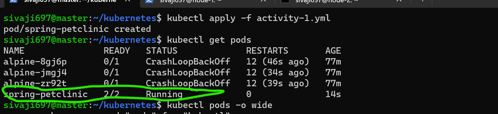
  * 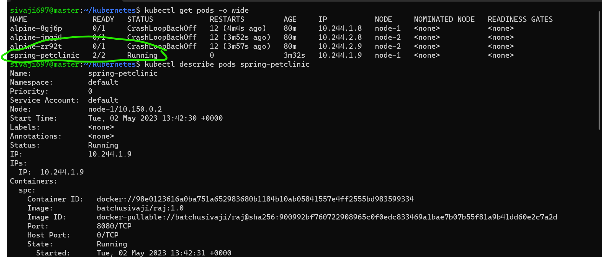
  * 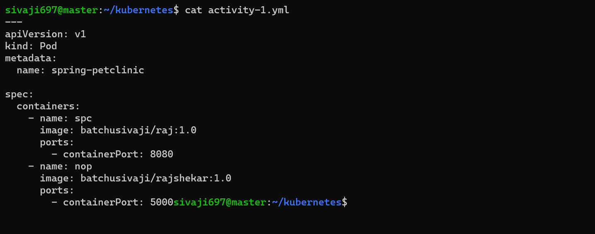
 
### 2). Write a Pod Spec for Spring PetClinic
-----------------------------------------------------------------------
```yml
apiVersion: v1
kind: Pod
metadata:
  name: spring-petclinic
spec:
  containers:
    - name: spc
      image: batchusivaji/raj:1.0
      ports:
        - containerPort: 8080
 ```
  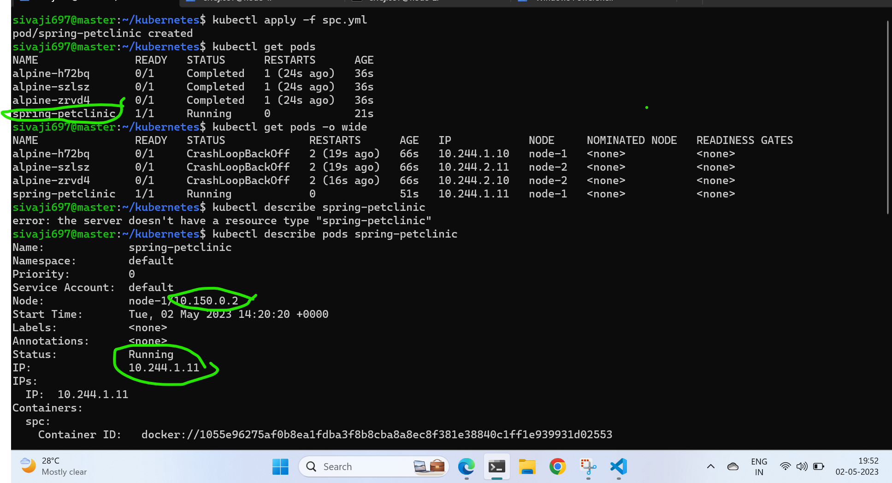
  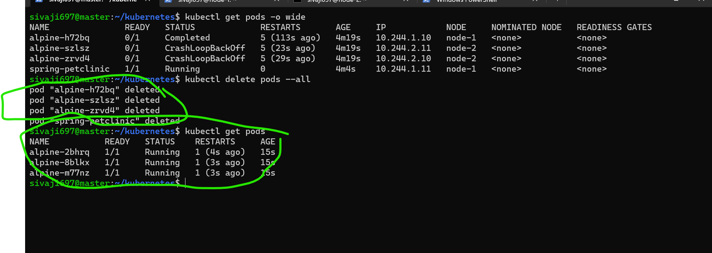
----------------------------------------------------------------------------
###  Write a Pod Spec for nopcommerse
```yml
apiVersion: v1
kind: Pod
metadata:
  name: nopcommerse
spec:
  containers:
    - name: spc
      image: batchusivaji/rajshekar:1.0
      ports:
        - containerPort: 5000
 ```
  * kubectl apply -f <nop.yml>
  * kubectl get pods
  * kubectl get pods -o wide
  * kubectl describe pods (podname)
  
  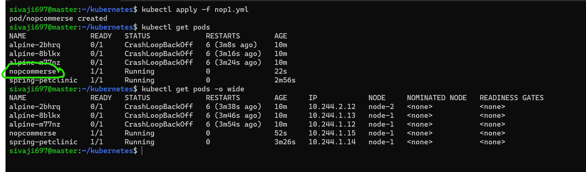
  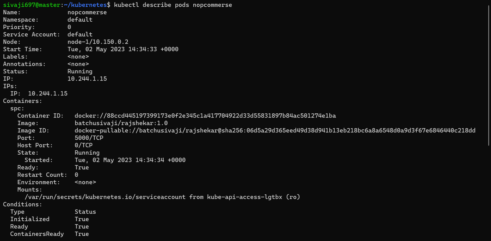
  ----------------------------------------------------------------------

## K8S ARCHITECTURE

* .Kubernetes is an architecture that offers a loosely coupled mechanism for service discovery across a cluster. A Kubernetes cluster has one or more control planes, and one or more compute nodes.
* .Environments running Kubernetes consist of the following key components:
* .Control plane:It manges the k8s clusters and Workloads and it has componetns like API server,Schedular and control manger
* .API Server:It servers as front end for k8s to communicate with control plane componets and worker nodes and handling external and internal request.
* .Schedular:This component is responsible for scheduling pods on specific nodes according to automated workflows.
* .Control manger:The Kubernetes controller manager is a control loop that monitors and regulates the state of a Kubernetes cluster.
* .etcd:It is component in control plane which stores the data of cluster state and configuration.
* .cloud-controller-manager:This component can embed cloud-specific control logic - for example, it can access the cloud provider’s load balancer service.
Worker nodes:
* .Nodes: Nodes are physical or virtual machines that can run pods as part of a Kubernetes cluster. A cluster can scale up to 5000 nodes.
* .Pods: A pod serves as a single application instance, and is considered the smallest unit in the object model of Kubernetes.
* .kubelet: Each node contains a kubelet, which is a small application that can communicate with the Kubernetes control plane.
* .kube-proxy:It handles all network communications outside and inside the cluster, forwarding traffic or replying on the packet filtering layer of the operating system. 
* 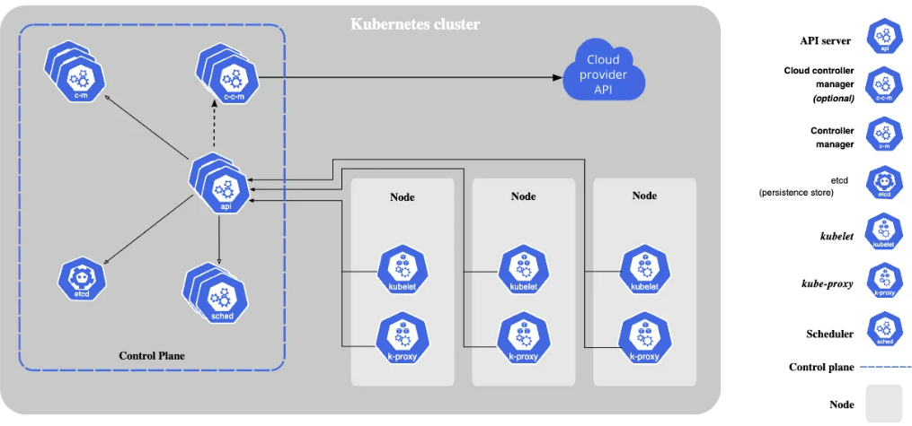
  
----------------------------------------------------------------------------
### GAME OF LIFE
first we create k8s pods like gol 
```yml
apiVersion: v1
kind: Pod
metadata:
  name: game of life
spec:
  containers:
    - name: gol
      image: batchusivaji/kishore:1.1
      ports:
        - containerPort: 8080
```
  * kubectl apply -f <gol.yml>     - 
  * kubectl get pods
  * kubectl get pods -o wide
  * kubectl describe pods (podname)
  * kubectl delete pods --all
  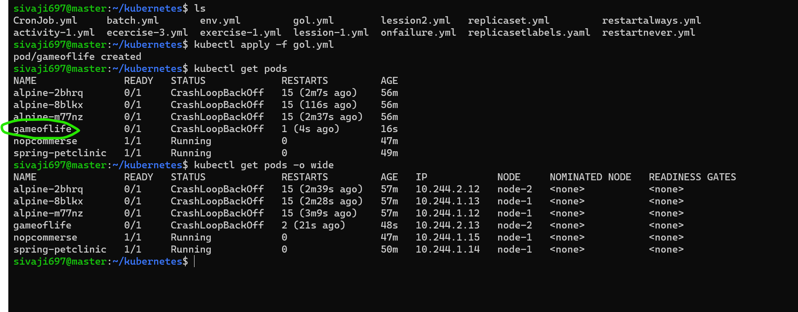
  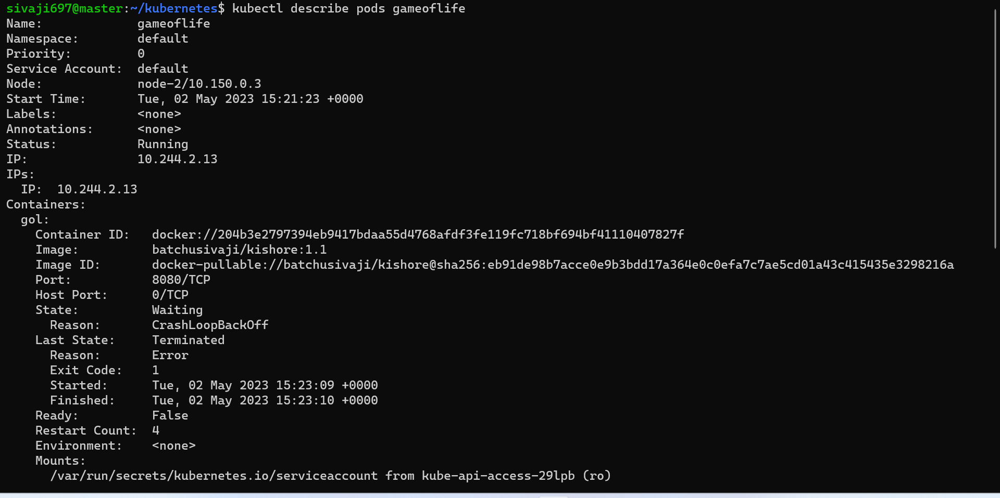
-----------------------------------------------------------------
## REPLICASET manifest file
 * kubectl apply -f <replicaset.yml>     - 
  * kubectl get pods
  * kubectl get pods -o wide
  * kubectl describe pods (podname)
  * kubectl delete pods --all

```yml
apiVersion: apps/v1
kind: ReplicaSet
metadata:
  labels: 
    app: alpine
  name: alpine
spec:
  minReadySeconds: 2
  replicas: 3
  selector: 
    matchLabels: 
      app: 'alpine'
  template: 
    metadata:
      labels: 
        app: alpine
    spec:
      containers:
        - name: alpine
          image: alpine
          args:
            - sleep 
            - 10s
```
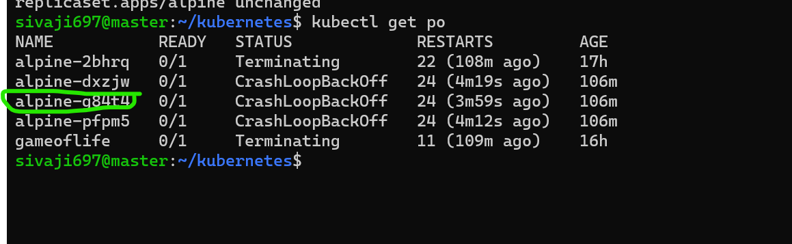
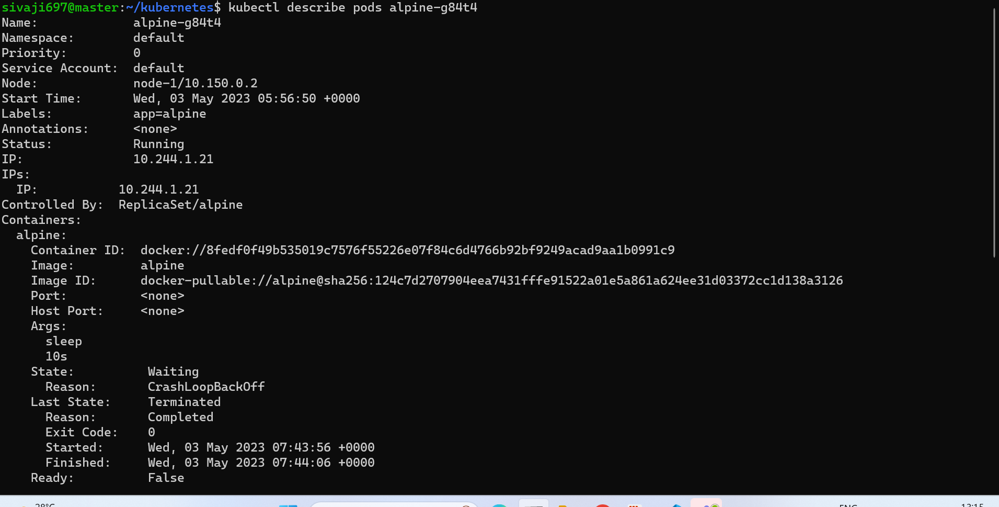
--------------------------------
  ### restart always manifest file
  
  ```yml
apiVersion:	v1
kind: Pod	
metadata:
  name: restartalways
spec:
  restartPolicy: Always
  containers:
    - name: jenkins
      image: jenkins/jenkins:jdk11-hotspot-windowsservercore-2019
      args:
        - sleep
        - 10s

  ```
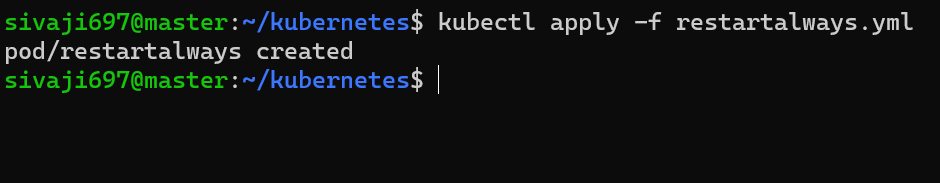
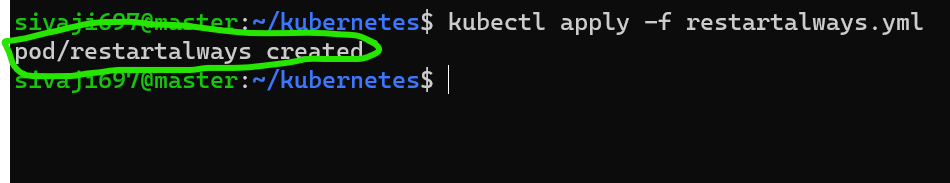

----------------------------------------------------------------------------
### Restart never

```yml
apiVersion:	v1
kind: Pod	
metadata:
  name: restarnever
spec:
  restartPolicy: Never
  containers:
    - name: gameoflife
      image: batchusivaji/kishore:1.1
      args:
        - sleep
        - 1d 

```
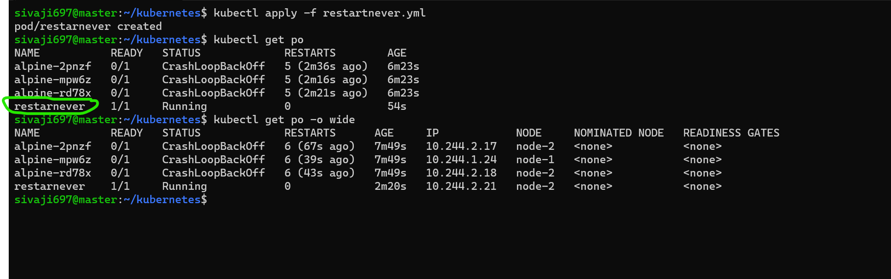
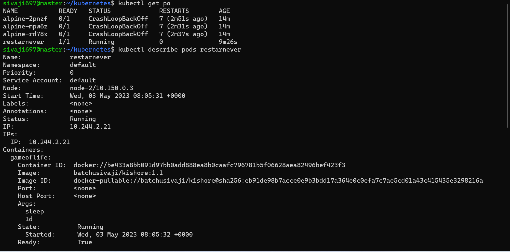
 
 ###