........................................KUBERNETES........................
                                          
### 1) Write a Pod Spec for Spring PetClinic as well as nopCommerce Applications at the same spec EXPOSE ports spc & nop
ANS: first we create k8s pods like spc & nop
-------------------------------------------------------------------
 ```yml
apiVersion: v1
kind: Pod
metadata:
  name: spring-petclinic
spec:
  containers:
    - name: spc
      image: batchusivaji/raj:1.0
      ports:
        - containerPort: 8080
    - name: nop
      image: batchusivaji/rajshekar:1.0
      ports:
        - containerPort: 5000

```
Now we have to apply below commands
  * kubectl apply -f <manifest.yml>
  * kubectl get pods
  * kubectl get pods -o wide
  * kubectl describe pods (podname)
  * 
  * 
  * 
 
### 2). Write a Pod Spec for Spring PetClinic
-----------------------------------------------------------------------
```yml
apiVersion: v1
kind: Pod
metadata:
  name: spring-petclinic
spec:
  containers:
    - name: spc
      image: batchusivaji/raj:1.0
      ports:
        - containerPort: 8080
 ```
  
  
----------------------------------------------------------------------------
###  Write a Pod Spec for nopcommerse
```yml
apiVersion: v1
kind: Pod
metadata:
  name: nopcommerse
spec:
  containers:
    - name: spc
      image: batchusivaji/rajshekar:1.0
      ports:
        - containerPort: 5000
 ```
  * kubectl apply -f <nop.yml>
  * kubectl get pods
  * kubectl get pods -o wide
  * kubectl describe pods (podname)
  
  
  
  ----------------------------------------------------------------------

## K8S ARCHITECTURE

* .Kubernetes is an architecture that offers a loosely coupled mechanism for service discovery across a cluster. A Kubernetes cluster has one or more control planes, and one or more compute nodes.
* .Environments running Kubernetes consist of the following key components:
* .Control plane:It manges the k8s clusters and Workloads and it has componetns like API server,Schedular and control manger
* .API Server:It servers as front end for k8s to communicate with control plane componets and worker nodes and handling external and internal request.
* .Schedular:This component is responsible for scheduling pods on specific nodes according to automated workflows.
* .Control manger:The Kubernetes controller manager is a control loop that monitors and regulates the state of a Kubernetes cluster.
* .etcd:It is component in control plane which stores the data of cluster state and configuration.
* .cloud-controller-manager:This component can embed cloud-specific control logic - for example, it can access the cloud provider’s load balancer service.
Worker nodes:
* .Nodes: Nodes are physical or virtual machines that can run pods as part of a Kubernetes cluster. A cluster can scale up to 5000 nodes.
* .Pods: A pod serves as a single application instance, and is considered the smallest unit in the object model of Kubernetes.
* .kubelet: Each node contains a kubelet, which is a small application that can communicate with the Kubernetes control plane.
* .kube-proxy:It handles all network communications outside and inside the cluster, forwarding traffic or replying on the packet filtering layer of the operating system. 
* 
  
----------------------------------------------------------------------------
### GAME OF LIFE
first we create k8s pods like gol 
```yml
apiVersion: v1
kind: Pod
metadata:
  name: game of life
spec:
  containers:
    - name: gol
      image: batchusivaji/kishore:1.1
      ports:
        - containerPort: 8080
```
  * kubectl apply -f <gol.yml>     - 
  * kubectl get pods
  * kubectl get pods -o wide
  * kubectl describe pods (podname)
  * kubectl delete pods --all
  
  
-----------------------------------------------------------------
## REPLICASET manifest file
 * kubectl apply -f <replicaset.yml>     - 
  * kubectl get pods
  * kubectl get pods -o wide
  * kubectl describe pods (podname)
  * kubectl delete pods --all

```yml
apiVersion: apps/v1
kind: ReplicaSet
metadata:
  labels: 
    app: alpine
  name: alpine
spec:
  minReadySeconds: 2
  replicas: 3
  selector: 
    matchLabels: 
      app: 'alpine'
  template: 
    metadata:
      labels: 
        app: alpine
    spec:
      containers:
        - name: alpine
          image: alpine
          args:
            - sleep 
            - 10s
```


--------------------------------
  ### restart always manifest file
  
  ```yml
apiVersion:	v1
kind: Pod	
metadata:
  name: restartalways
spec:
  restartPolicy: Always
  containers:
    - name: jenkins
      image: jenkins/jenkins:jdk11-hotspot-windowsservercore-2019
      args:
        - sleep
        - 10s

  ```


----------------------------------------------------------------------------
### Restart never

```yml
apiVersion:	v1
kind: Pod	
metadata:
  name: restarnever
spec:
  restartPolicy: Never
  containers:
    - name: gameoflife
      image: batchusivaji/kishore:1.1
      args:
        - sleep
        - 1d 

```


### CronJob
```yml
apiVersion: batch/v1
kind: CronJob
metadata:
  name: cronob-labels
  labels:
    app: lebel-redis
spec:
  schedule: 1 * * * *
  jobTemplate:
    metadata:
      name: cronob-labels
      labels:
        app: label-redis
    spec:
      template:
        metadata:
          labels:
            app: label-redis
          name: cronob-labels
        spec:
          restartPolicy: OnFailure
          containers:
            - name: spc
              image: redis:7.2 
              args:
                - sleep
              command:
                - 10s

  
```
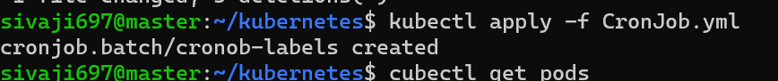
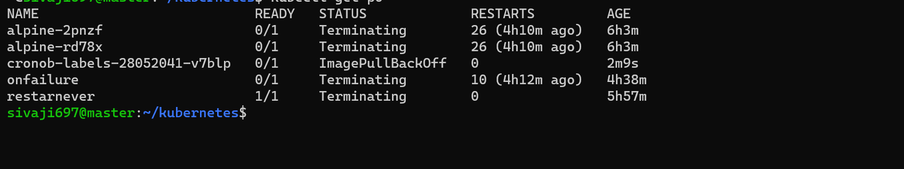
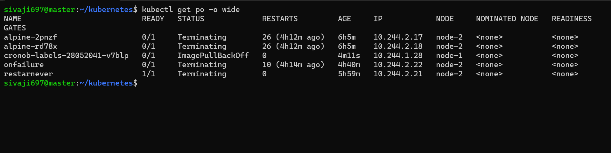
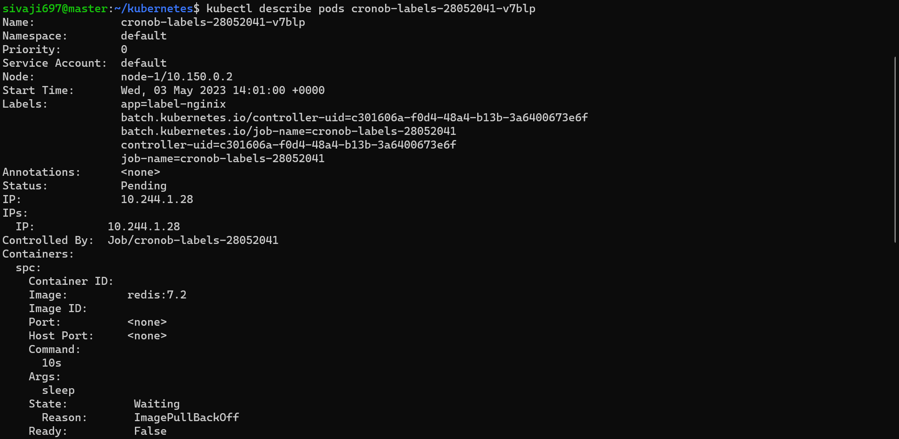
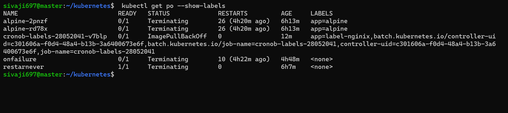 
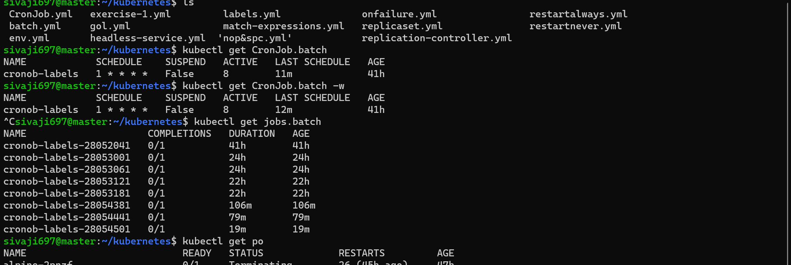

### Replication controller

```yml
apiVersion: v1
kind: ReplicationController
metadata:
  name: replication-controller
  labels:
    app: redis
spec:
  minReadySeconds: 2
  replicas: 2
  selector:
    app: redis                
  template:
    metadata:
      labels:
        app: redis
    spec:
      containers:
        - name: redis
          image: redis
          args:
            - sleep
            - 10s
 ```
 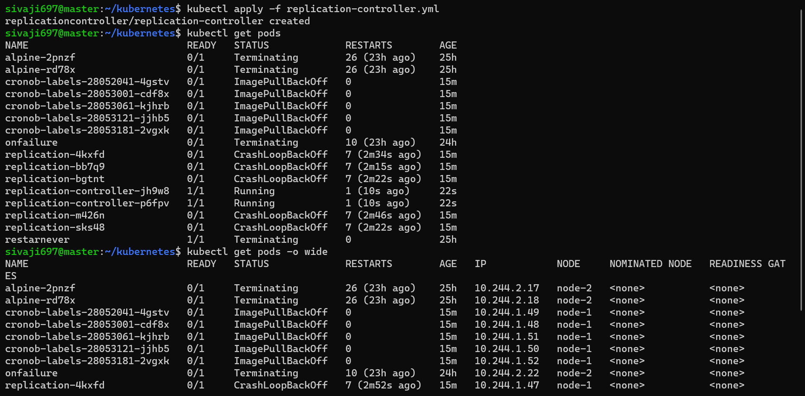
 

 ### Match-expressions using manifest file
 ```yml
apiVersion:	apps/v1
kind: ReplicaSet
metadata:
  name: setbased
  labels: # label is not reqired
    app: redis
spec:
  minReadySeconds: 2
  replicas: 2
  selector: # to set based selector , can be used to select multiple options in single selection
    matchExpressions:
      - key: app
        operator: In
        values:
          - apache2
          - nginix
      - key: dev
        operator: NotIn
        values:
          - linux
          - unix
  template:
    metadata:
      name: match-expressions
      labels:
        app: apache2 # this spec is used in selector
        dev: developer
    spec: 
      containers:
        - name: redis
          image: redis:7.2
          args:
            - sleep
          command:
            - 10s
```
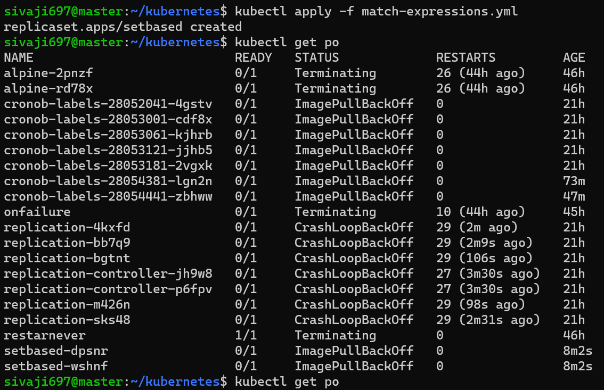
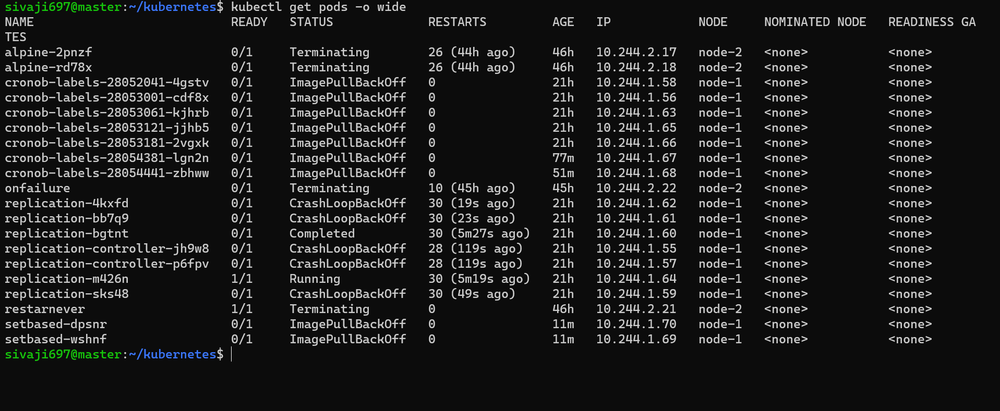
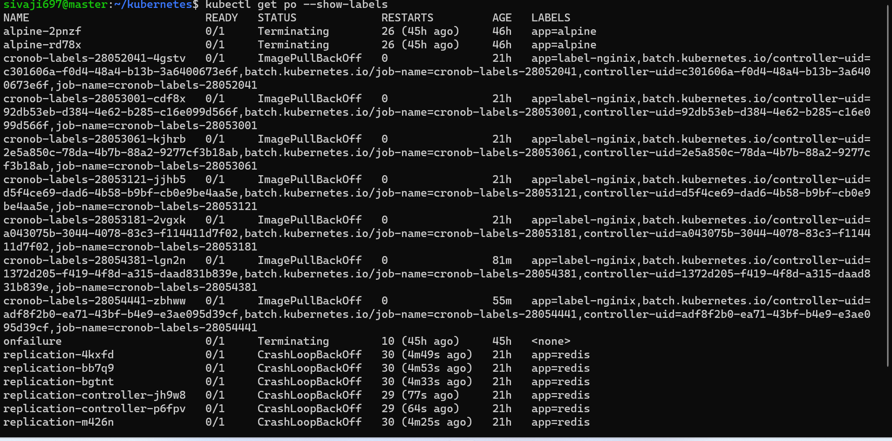
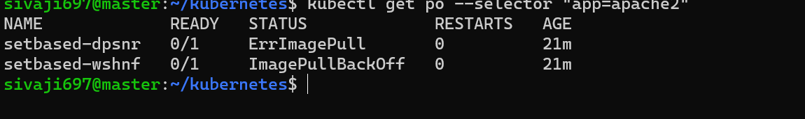

### apiversion :
apiVersion specifies which version of the Kubernetes API to use to create the object
### kind:
kind specifies the kind of object defined in this yaml file, here a Service
metadata helps uniquely identify our Service object: we give it a name (myloadbalancer), and a label.
### spec:
spec specifies the Service. It is of LoadBalancer type. We then go on to specify its ports. We can define many ports if we want but here we just specify the necessary port 8000 for our whoami app. Since 8000 is an HTTP ports: we add a name tag and call it http. targetPort is the port the container welcomes traffic (in our case necessarily 8000), port is the abstracted Service port. For simplicity, we set both as 8000, though we could change port to something else.
### selector:
selector tells the Service which pods to redirect to: in this case pods with containers running the app we called mydeployment Save and exit the file.

# Deployments, ReplicaSets and Services

These are all type of controllers. 

****Benefits of Controllers****
- Application reliability: where multiple instances of an application running, prevent problems if one or more instance fails.
- Scaling: when your pods experience a high volume of requests, kubernetes allows you to scale up your pods, allowing for a better user experience. 
- Load balancing: where having multiple versionsof a pod running allow traffic to flow to different pods, and doesnt overload a single pod or node

****Kinds of Controllers****
- ReplicaSets
- Deployments 
- DaemonSets
- Jobs
- Services

## ReplicaSets
Ensures that the specified number of replica for a pod are running at all times.

## Deployments
A deployment controller provides declarative updates for pods and ReplicaSets.

- This means you can describe the desired state of a deployment in a YAML file, and the deployment controller will align the actual state to match. 
- Manages a ReplicaSet.

- pod management: running a ReplicaSet allows you to deploy a number of pods, and check their status as a single unit.

- Pause and Resume: pause deployment, make changes, resume deployment. 

## DaemonSets
DaemonSets ensure that all nodes run a copy of a specific pod.

- As nodes are added and removed from the cluster, a DaemonSet will add or remove the required pods. 

## Jobs 
A supervisor process for pods carrying out batch jobs.

- Jobs are used to run indivual processes that run once and complete successfully. 

## Services
A service allows the communcation between one set of deployments with another. 

- use a service to get pods in two deployments to talk to each other. 

***Kinds of Services***
- Internal: IP is only reachable within the cluster 
- External: endpoint available through node IP: port (called NodePort)
- Load Balancer: Exposes application to the internet with a load balancer (available with a cloud provider)
###
### Liveness probe:
used to continue checking the availability of a Pod
### Readiness Probe:
used to make sure a Pod is not published as available until the readinessProbe has been able to access it.
### Startup Probe:
 If we define a startup probe for a container, then Kubernetes does not execute the liveness or readiness probes, as long as the container's startup probe does not succeed.
## configure pods:
### initialDelaySeconds:
 Number of seconds after the container has started before liveness or readiness probes are initiated. Defaults to 0 seconds. Minimum value is 0.
### periodSeconds:
 How often (in seconds) to perform the probe. Default to 10 seconds. Minimum value is 1.
### timeoutSeconds:
 Number of seconds after which the probe times out. Defaults to 1 second. Minimum value is 1.
### successThreshold:
 Minimum consecutive successes for the probe to be considered successful after having failed. Defaults to 1. Must be 1 for liveness and startup Probes. Minimum value is 1.
### failureThreshold:
 When a probe fails, Kubernetes will try failureThreshold times before giving up. Giving up in case of liveness probe means restarting the container. In case of readiness probe the Pod will be marked Unready. Defaults to 3. Minimum value is 1.

### LoadBalancer :
this Service exposes a set of pods using an external load balancer. All managed Kubernetes offerings have their own implementation of it
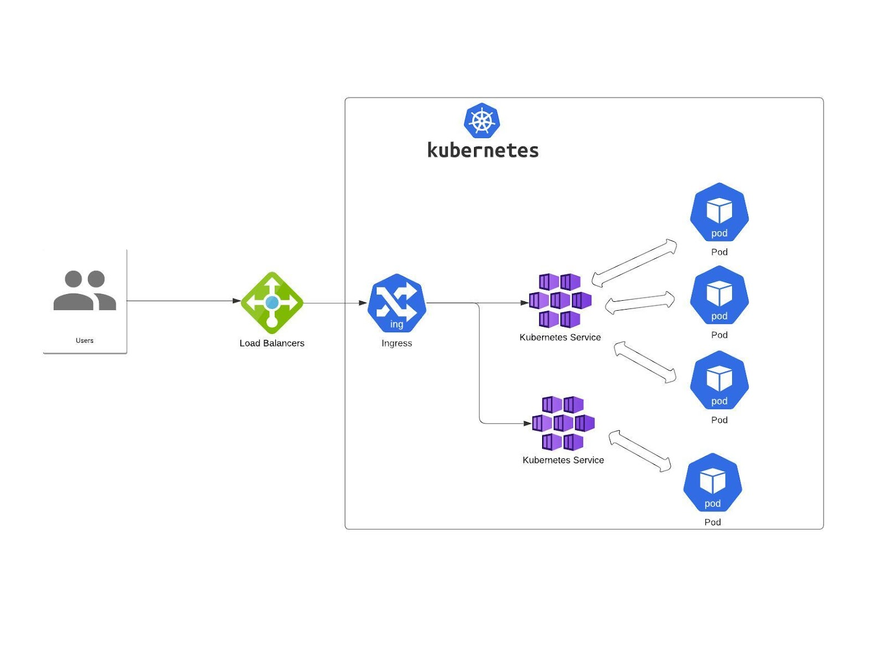

### NodePort : 
the Service exposes a given port on each Node IP in the cluster.
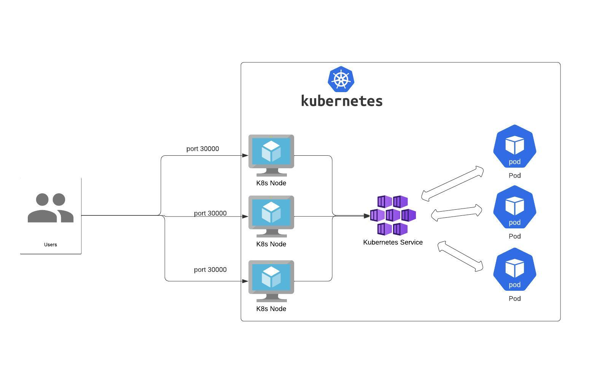

### Ingress:  
NodePort and LoadBalancer let you expose a service by specifying that value in the service’s type. Ingress, on the other hand, is a completely independent resource to your service. You declare, create and destroy it separately to your services.

This makes it decoupled and isolated from the services you want to expose. It also helps you to consolidate routing rules into one place.

The one downside is that you need to configure an Ingress Controller for your cluster. But that’s pretty easy—in this example, we’ll use the Nginx Ingress Controller.


### Liveness and Readiness probe
```yml
apiVersion: apps/v1
kind: ReplicaSet
metadata:
  name: jenkis-sever-healthchecks
  labels:
    app: server
spec:
  minReadySeconds: 1
  replicas: 2
  selector:
    matchExpressions:
      - key: developer
        operator: In
        values:
          - web
          - dev
      - key: tester
        operator: NotIn
        values:
          - qt
          - ihub
  template:
    metadata:
      name: qualityThought
      labels:
        developer: dev
        tester: deploy 
    spec:
      containers:
        - name: jenkins
          image: jenkins/jenkins:2.387.3-lts
          ports:
            - containerPort: 8080
              protocol: TCP
          readinessProbe:
            failureThreshold: 1
            initialDelaySeconds: 1
            periodSeconds: 10
            successThreshold: 2
            timeoutSeconds: 1
            exec:
              command:
                - sleep
                - 10mb
          livenessProbe:
            failureThreshold: 2
            initialDelaySeconds: 1
            periodSeconds: 10
            successThreshold: 1
            timeoutSeconds: 1
            exec:
              command:
                - sleep
                - 5s
```
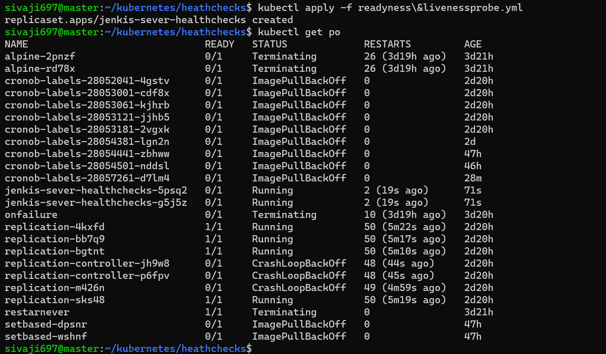
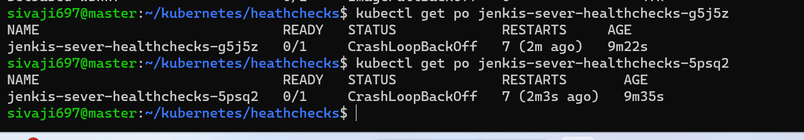
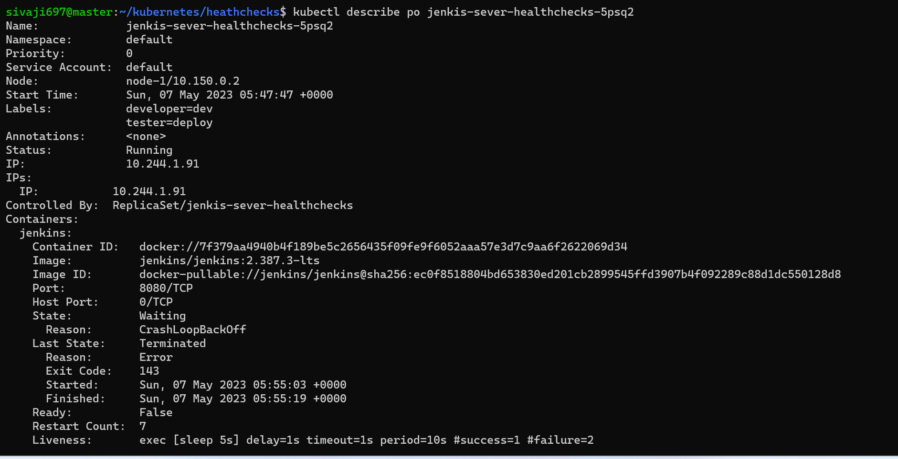
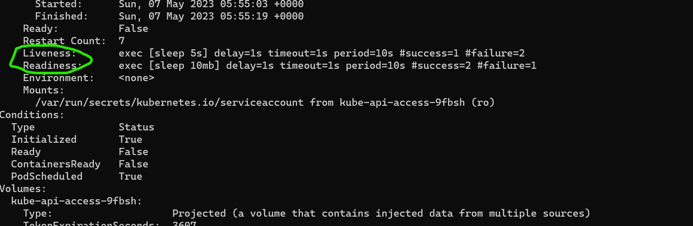
`
### pod:
Collections of containers collocated in a single machine

### Service:
Load balancer that can bring traffic to a collection of pods

### Deployment:
Replicate a container for availability or scale.

### Kubelet:
The primary node agent that runs on each node

# What is Kubernetes?
Kubernetes is an orchestrator for containers like Swarm, runs on top of Docker usually as a set of APIs in containers.

Provides API or CLI to manage container across servers.

Many clouds provide it for you.

Many vendors make a "distribution" of it.

# System parts:
### Kubernetes:
The whole orchestratuion system
### Kubectl:
CLI to manage Kubernetes and manage apps.
### Node:
Single server in the Kubernetes cluster.
### Kubelet:
Kubernetes agent running on nodes.
### Control Plane:
Set of containers that manage the cluster.
### Pods:
Basic unit of deployment, containers are always in pods.
### Controller: 
For creating/updating pods and other objects.
### Service: 
Endpoint to connect to a pod.
### Namespace: 
Filtered group of objects in cluster.

Creating pods with kubectl
First, be sure kubernetes its running:

kubectl version

### Two ways to deploy Pods(containers): via CLI or via YAML.

### Scaling a ReplicaSet:
Example of scaling an existing Apache server replica:

kubectl scale deploy/my-apache --replicas 2
or
kubectl scale deployment my-apache --replicas 2

Inspecting Deployment Objects
Showing your pods:

kubectl get pods

# Basic Service Types:
### ClusterIP (default):
Single, internal virtual IP allocated.
Only reachable within the cluster (nodes and pods).
Pods can reach service on apps port number.
### NodePort:
High port allocated on each node.
Port it's open on every node's IP.
Anyone can connect (if they can reach node).
Other pods need to be updated to this port.
These services are always available in Kubernetes.
### ReplicationController:
High availability
Scaling can be done
Loadbalancing setup
Adding your pod to ReplicationController will make sure to create new/multiple replicas of pod automatically.

### What is Kubernetes?
In simple terms, Kubernetes is a container orchestration tool. It helps in maintaining the containers.

When we build a containerized application and if there are large number of such containers, we need tool such as Kubernetes that help us to manage those containers and automate our workflow.

# What features does Kubernetes provides?
### High Availability : 
The user should not have any downtime.
### Scalability: 
the application normally have very high response time.
### Disaster Recovery :
 backup and restore.
# Kubernetes basic terminologies
### Pods: 
Pods are the smallest and the most basic unit in Kubernetes. Each pod get their own IP address so that they can communicate. A pod may be running a service like any application usually within a container.
### Service: 
Service is logical set of pods and each pod will have their own service. Lifecycle of Pod and service are not interconnected. Service are generally categorized into:
Internal
External
### Node : 
A node is a single host in K8s. This is used to run virtual or physical machine. There may be multiple/single pods within a node.
### ReplicaSet:
It is used to identify the particular number of pod replicas running inside a node.
### ConfigMap :
It contains all the external configuration of our application like database URL. The reason we need this is because this acts as a central repo to other components so if we have to make any changes like change in DB_URL we can simply change here and all changees will be reflected back.
⚠ DO NOT STORE CREDENTIALS ON CONFIGMAP.
### Secret:
As name suggests it stores all the secret info like DB_USERNAME and DB_PASSWORD. We should always store such info in encrypted format rather than plain text.
### Volumes: 
This attaches a physical storage to the pod. Data mey be lost while resetting since it is not persistent.
⚠ K8s does not manage data persistence.
### Deployment:
 We do not directly create a pod in K8s. We create blueprint of the pod and the rest is handled by K8s. The blueprint for creating pod is called deployment.

### initcontainer

```yml
---
apiVersion:	v1
kind: Pod
metadata:
  name: initcontainers
  labels:
    run: webapp       
spec:
  containers:
    - name: nginx
      image: nginx:latest
      ports:
        - containerPort: 80 
  initContainers:
    - name: alpine
      image: alpine:latest
      args:
        - sleep
        - 15s
    - name: busybox
      image: busybox:1.28
      command:
        - 'sh' 
        - '-c'
        - "until nslookup nginx-svf.default.svc.cluster.local; do echo waiting for myservice; sleep 2; done"
       
  #### service file

  ---
apiVersion: v1
kind: Service
metadata:
  name: nginx-svf
  labels:
    run: nginx
spec:
  ports:
    - name: nginx
      port: 80
      protocol: TCP
      targetPort: 35000
  selector:
    run: nginx
```
  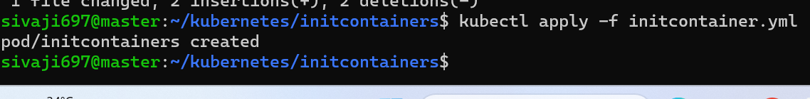
  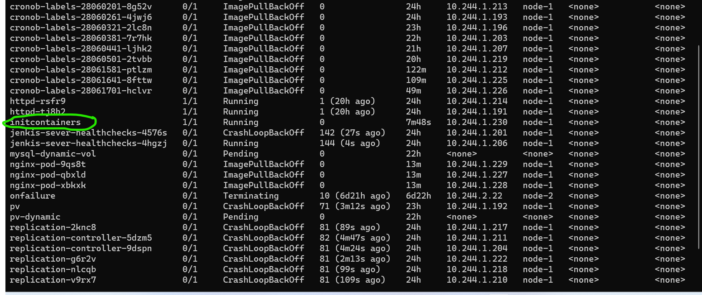
  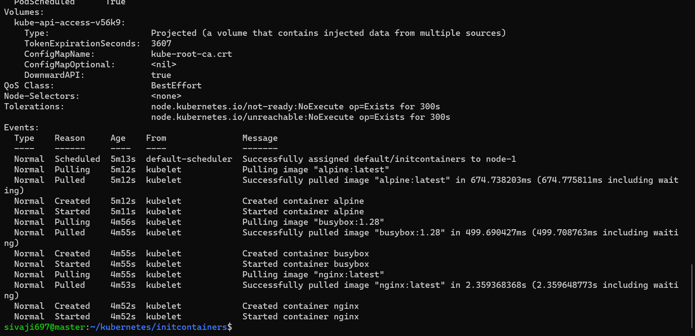
### Run pod with specific resourses
```yml
apiVersion: apps/v1
kind: ReplicaSet 
metadata:
  name: nginx-pod
  labels:
    run: pod
spec:
  minReadySeconds: 2
  replicas: 3
  selector:
    matchLabels:
      app: test
  template:
    metadata:
      name: nginx
      labels:
        app: test
    spec:
      containers:
        - name: nginx
          image: latest
          ports:
            - containerPort: 80
          livenessProbe:
            httpGet:
              path: /
              port: 80
          readinessProbe:
             httpGet:
               path: /
               port: 80
          resources:
            requests:
              memory: "64Mi"
              cpu: "256m"
            limits:
              memory: "256Mi"
              cpu: "1000m"
              
---
apiVersion: v1
kind: Service
metadata:
  name: nginx-svf
  labels:
    run: nginx
spec:
  ports:
    - name: nginx
      port: 80
      protocol: TCP
      targetPort: 35000
  selector:
    run: nginx
    
```
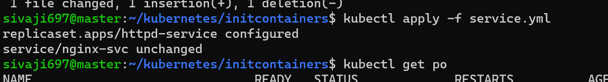
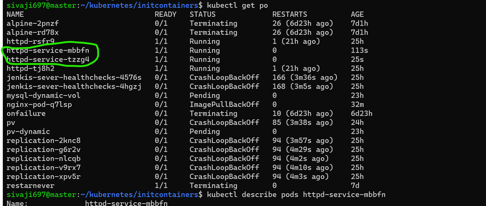
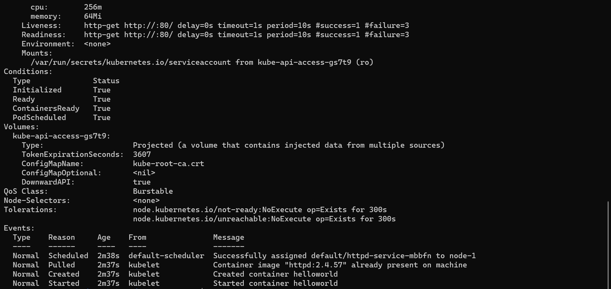
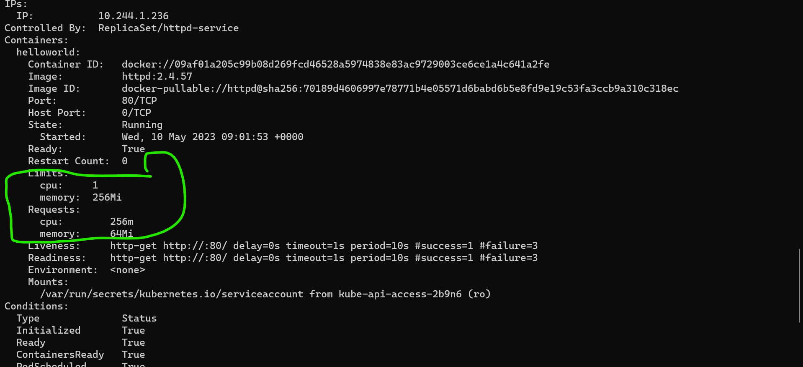
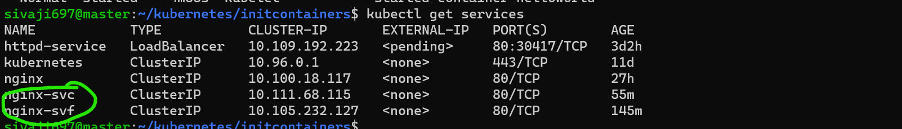

### rollout-rollback
```yml
---
apiVersion: apps/v1
kind: Deployment
metadata:
  name: deployment
  labels:
    run: server
spec: 
  minReadySeconds: 5
  replicas: 2
  selector:
    matchExpressions:
      - key: qat
        operator: In
        values:
          - test
          - pause

      - key: dev
        operator: NotIn
        values:
          - deploy
          - failure
  strategy:
    rollingUpdate:
      maxSurge: 2
      maxUnavailable: 1
  template:
    metadata:
      name: pod-creation
      labels:
        qat: test
        dev: env
    spec:
      containers: 
        - name: httpd-service
          image: httpd:2.4.57
          ports:
            - containerPort: 80
  
```
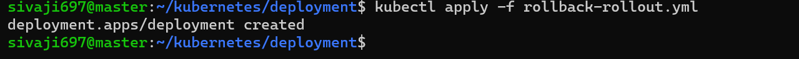
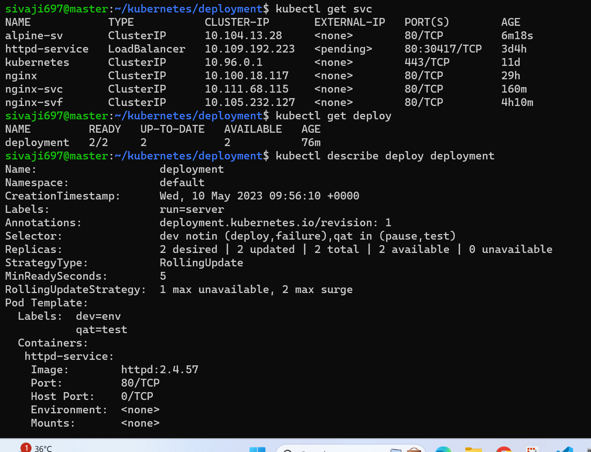
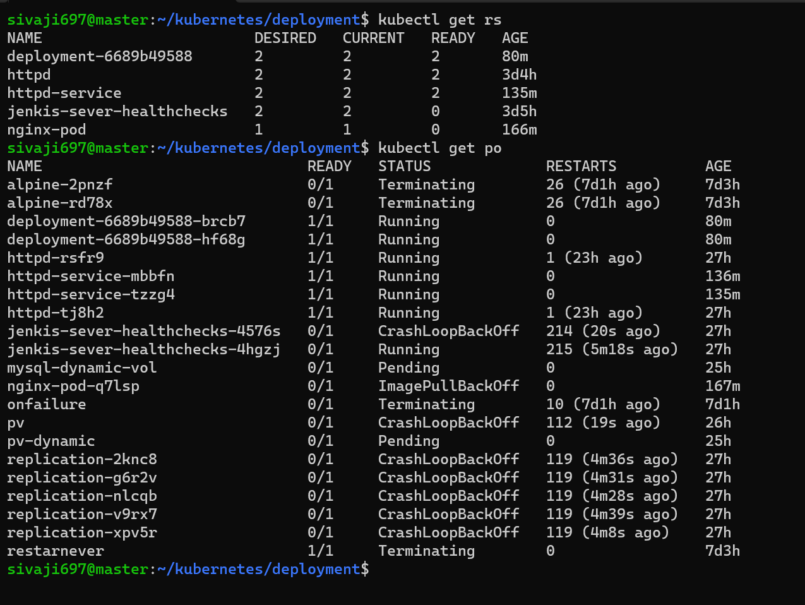
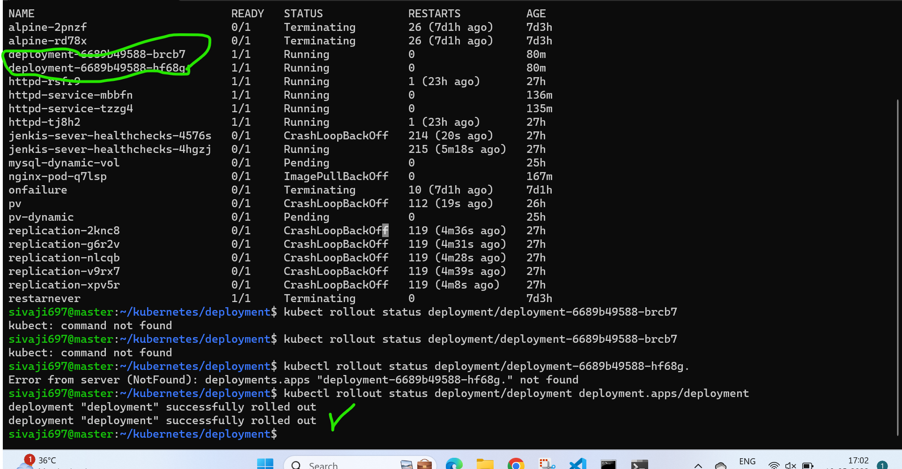
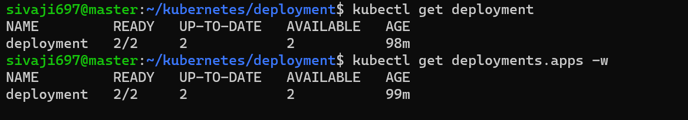

## RBAC(role base access control)
### role &role binding
```yml
apiVersion: rbac.authorization.k8s.io/v1
kind: Role
metadata: 
  name: qat-dev
  namespace: dev
rules:
  - apiGroups: ["*"]
    resources: [ pods ]
    verbs: 
      - get
      - watch
      - creat
```yml
apiVersion: rbac.authorization.k8s.io/v1
kind: Role
metadata: 
  name: qat-dev
  namespace: dev
rules:
  - apiGroups: ["*"]
    resources: [ pods ]
    verbs: 
      - get
      - watch
      - creat
```
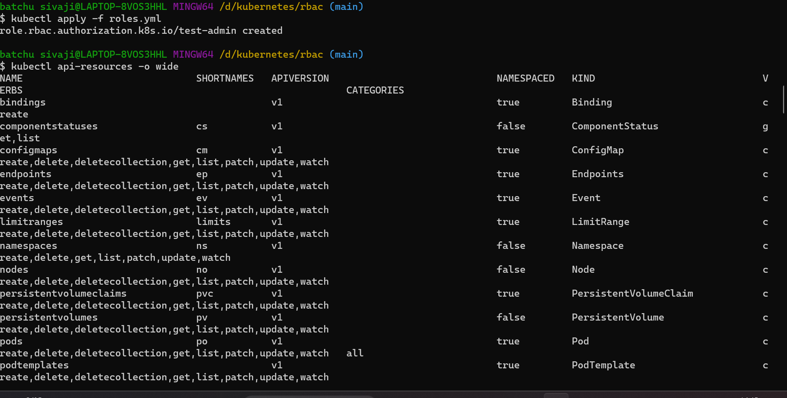
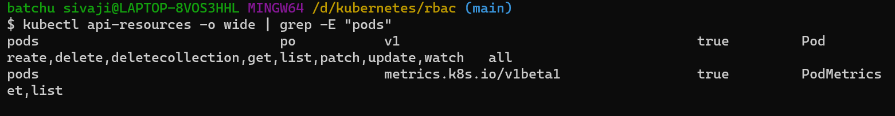
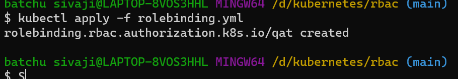
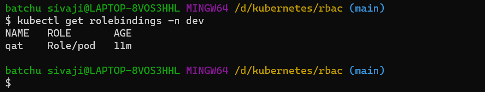

## kustamization

### deployment manifest file

```yml
apiVersion: apps/v1
kind: Deployment
metadata:
  name: nginx-deployment
  namespace: dev
  labels:
    app: nginx
spec:
  minReadySeconds: 4
  replicas: 1
  selector:
    matchLabels:
      app: nginx
  strategy:
    rollingUpdate:
      maxSurge: 2
      maxUnavailable: 1
    type: RollingUpdate
  template:
    metadata:
      name: nginx
      labels:
        app: nginx
    spec:
      containers:
        - name: nginx
          image: nginx:1.23.4-perl
          ports:
            - containerPort: 80


  ```
  ### service manifest file
  ```yml
apiVersion: v1
kind: Service
metadata:
  name: nginx
  labels:
    app: nginx
spec:
  selector:
    app: nginx
  ports:
    - port: 80
      protocol: TCP
      targetPort: 32000
  type: LoadBalancer

  ```
  ### horizontal pod autoscaling manifest file
  ```yml
  apiVersion: autoscaling/v1
kind: HorizontalPodAutoscaler
metadata:
  name: nginx
  namespace: dev
spec:
  maxReplicas: 8
  minReplicas: 2
  scaleTargetRef:
    kind: deployment
    name: dev
  targetCPUUtilizationPercentage: 65

  ```
  ### kustomization manifest file
  ```yml
apiVersion: kustomize.config.k8s.io/v1beta1
kind: Kustomization
namespace: dev
resources:
  - deployment.yml
  - horizontal-pod-autoscaling.yml
  - service.yml
  - namespace.yml
``` 
### namespace manifest file
```yml
apiVersion: v1
kind: Namespace
metadata:
  name: dev

  ```
  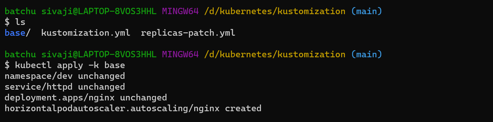
  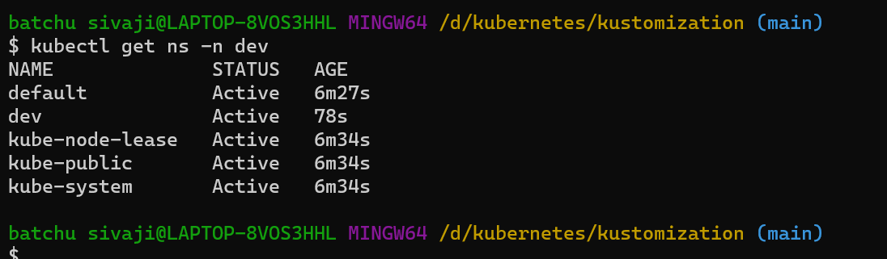
  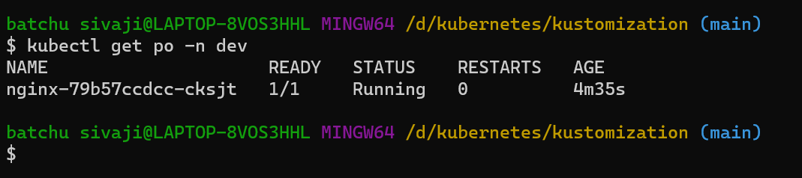
  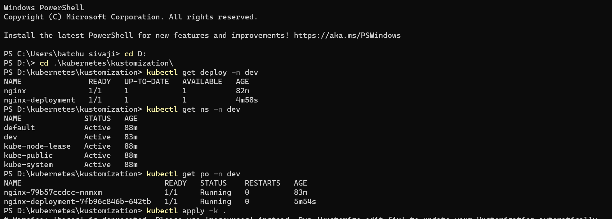
  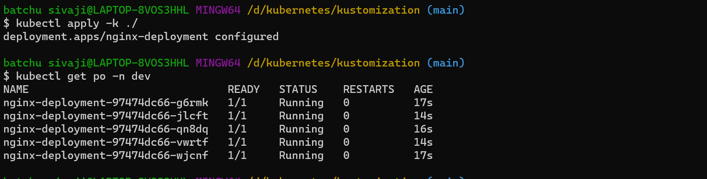


  ## horizontal pod auto scalling(hpa)

  hpa has maintaining the pods there are two types of pods maintaining pod

  * we have to pass the commanand
  * after that we have to apply below command
      kubectl apply -f <mainifest file name>
  * we have to create the hpa 
    `kubectl autoscale deployment nginx --cpu-percent=50 --min=1 --max=10` 
     then we have to check the hpa `kubectl get hpa`
  * then after that we have to increase or scaling the load
     `kubectl scale --replicas=10 -f <mainifest file name>`
  * we have to check the pods then we will automatically increase the pods
   it will depend on the cpu percentage after that we have to enter `cntrl+C` 
   then automatically decrease the pods that means killing the rs or pods
  
      `kubectl get hpa nginx --watch`


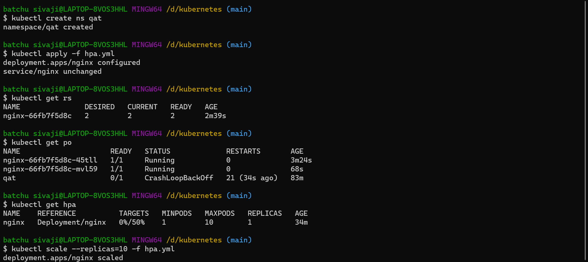
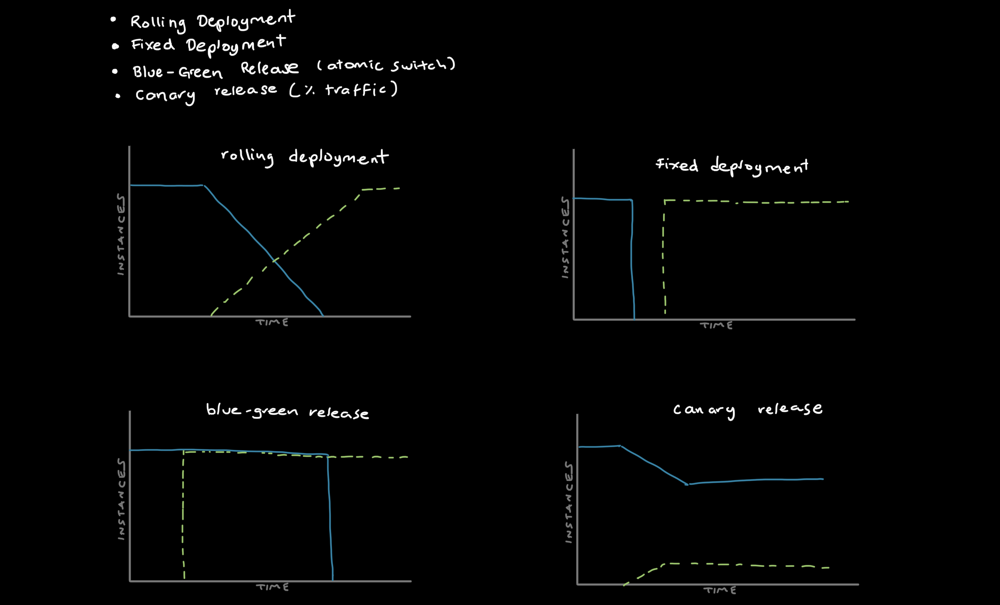
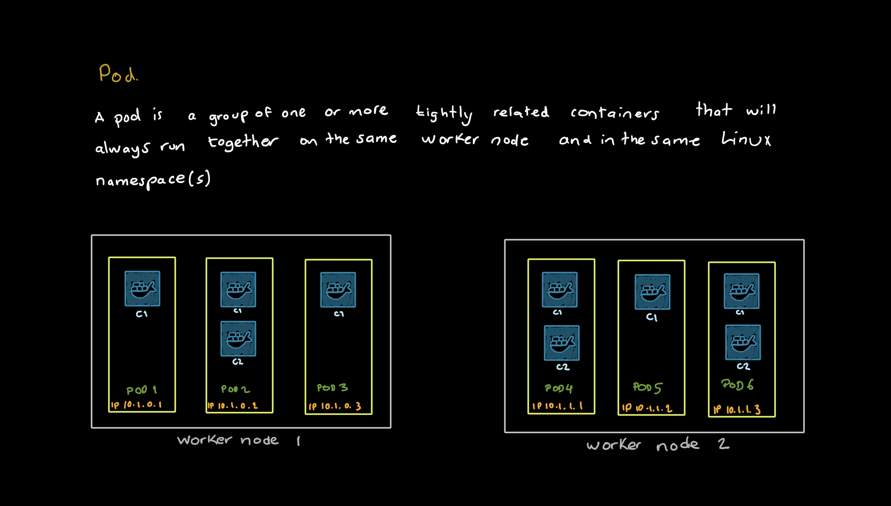
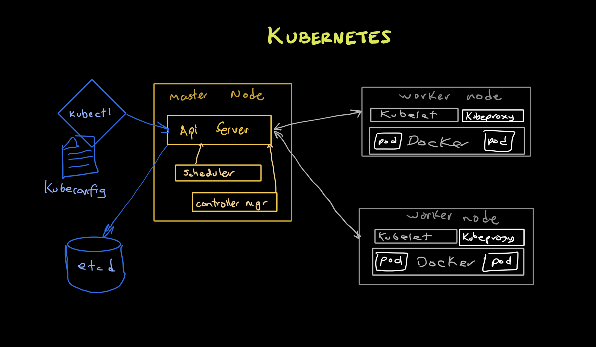