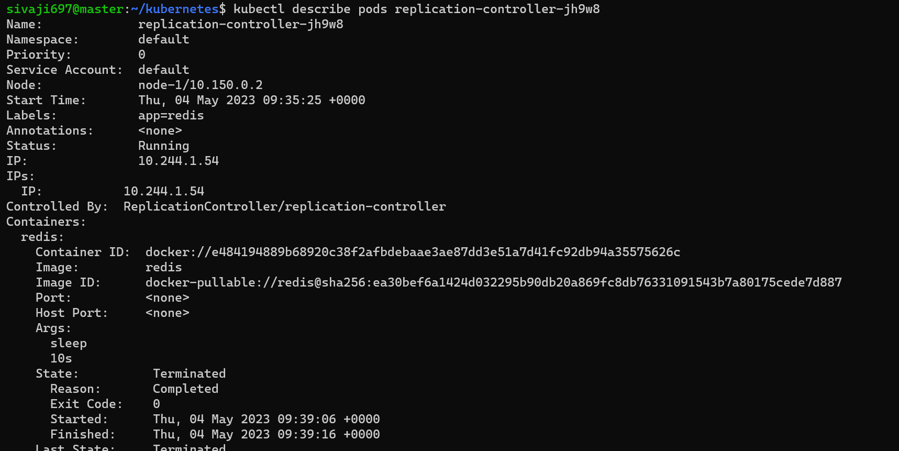

#                                                KUBERNETES
                                          
### 1) Write a Pod Spec for Spring PetClinic as well as nopCommerce Applications at the same spec EXPOSE ports spc & nop
ANS: first we create k8s pods like spc & nop
-------------------------------------------------------------------
 ```yml
apiVersion: v1
kind: Pod
metadata:
  name: spring-petclinic
spec:
  containers:
    - name: spc
      image: batchusivaji/raj:1.0
      ports:
        - containerPort: 8080
    - name: nop
      image: batchusivaji/rajshekar:1.0
      ports:
        - containerPort: 5000

```
Now we have to apply below commands
  * kubectl apply -f <manifest.yml>
  * kubectl get pods
  * kubectl get pods -o wide
  * kubectl describe pods (podname)
  * 
  * 
  * 
 
### 2). Write a Pod Spec for Spring PetClinic
-----------------------------------------------------------------------
```yml
apiVersion: v1
kind: Pod
metadata:
  name: spring-petclinic
spec:
  containers:
    - name: spc
      image: batchusivaji/raj:1.0
      ports:
        - containerPort: 8080
 ```
  
  
----------------------------------------------------------------------------
###  Write a Pod Spec for nopcommerse
```yml
apiVersion: v1
kind: Pod
metadata:
  name: nopcommerse
spec:
  containers:
    - name: spc
      image: batchusivaji/rajshekar:1.0
      ports:
        - containerPort: 5000
 ```
  * kubectl apply -f <nop.yml>
  * kubectl get pods
  * kubectl get pods -o wide
  * kubectl describe pods (podname)
  
  
  
  ----------------------------------------------------------------------

## K8S ARCHITECTURE

* .Kubernetes is an architecture that offers a loosely coupled mechanism for service discovery across a cluster. A Kubernetes cluster has one or more control planes, and one or more compute nodes.
* .Environments running Kubernetes consist of the following key components:
* .Control plane:It manges the k8s clusters and Workloads and it has componetns like API server,Schedular and control manger
* .API Server:It servers as front end for k8s to communicate with control plane componets and worker nodes and handling external and internal request.
* .Schedular:This component is responsible for scheduling pods on specific nodes according to automated workflows.
* .Control manger:The Kubernetes controller manager is a control loop that monitors and regulates the state of a Kubernetes cluster.
* .etcd:It is component in control plane which stores the data of cluster state and configuration.
* .cloud-controller-manager:This component can embed cloud-specific control logic - for example, it can access the cloud provider’s load balancer service.
Worker nodes:
* .Nodes: Nodes are physical or virtual machines that can run pods as part of a Kubernetes cluster. A cluster can scale up to 5000 nodes.
* .Pods: A pod serves as a single application instance, and is considered the smallest unit in the object model of Kubernetes.
* .kubelet: Each node contains a kubelet, which is a small application that can communicate with the Kubernetes control plane.
* .kube-proxy:It handles all network communications outside and inside the cluster, forwarding traffic or replying on the packet filtering layer of the operating system. 
* 
  
----------------------------------------------------------------------------
### GAME OF LIFE
first we create k8s pods like gol 
```yml
apiVersion: v1
kind: Pod
metadata:
  name: game of life
spec:
  containers:
    - name: gol
      image: batchusivaji/kishore:1.1
      ports:
        - containerPort: 8080
```
  * kubectl apply -f <gol.yml>     - 
  * kubectl get pods
  * kubectl get pods -o wide
  * kubectl describe pods (podname)
  * kubectl delete pods --all
  
  
-----------------------------------------------------------------
## REPLICASET manifest file
 * kubectl apply -f <replicaset.yml>     - 
  * kubectl get pods
  * kubectl get pods -o wide
  * kubectl describe pods (podname)
  * kubectl delete pods --all

```yml
apiVersion: apps/v1
kind: ReplicaSet
metadata:
  labels: 
    app: alpine
  name: alpine
spec:
  minReadySeconds: 2
  replicas: 3
  selector: 
    matchLabels: 
      app: 'alpine'
  template: 
    metadata:
      labels: 
        app: alpine
    spec:
      containers:
        - name: alpine
          image: alpine
          args:
            - sleep 
            - 10s
```


--------------------------------
  ### restart always manifest file
  
  ```yml
apiVersion:	v1
kind: Pod	
metadata:
  name: restartalways
spec:
  restartPolicy: Always
  containers:
    - name: jenkins
      image: jenkins/jenkins:jdk11-hotspot-windowsservercore-2019
      args:
        - sleep
        - 10s

  ```


----------------------------------------------------------------------------
### Restart never

```yml
apiVersion:	v1
kind: Pod	
metadata:
  name: restarnever
spec:
  restartPolicy: Never
  containers:
    - name: gameoflife
      image: batchusivaji/kishore:1.1
      args:
        - sleep
        - 1d 

```


### CronJob
```yml
apiVersion: batch/v1
kind: CronJob
metadata:
  name: cronob-labels
  labels:
    app: lebel-redis
spec:
  schedule: 1 * * * *
  jobTemplate:
    metadata:
      name: cronob-labels
      labels:
        app: label-redis
    spec:
      template:
        metadata:
          labels:
            app: label-redis
          name: cronob-labels
        spec:
          restartPolicy: OnFailure
          containers:
            - name: spc
              image: redis:7.2 
              args:
                - sleep
              command:
                - 10s

  
```


 


### Replication controller

```yml
apiVersion: v1
kind: ReplicationController
metadata:
  name: replication-controller
  labels:
    app: redis
spec:
  minReadySeconds: 2
  replicas: 2
  selector:
    app: redis                
  template:
    metadata:
      labels:
        app: redis
    spec:
      containers:
        - name: redis
          image: redis
          args:
            - sleep
            - 10s
 ```
 
 

 ### Match-expressions using manifest file
 ```yml
apiVersion:	apps/v1
kind: ReplicaSet
metadata:
  name: setbased
  labels: # label is not reqired
    app: redis
spec:
  minReadySeconds: 2
  replicas: 2
  selector: # to set based selector , can be used to select multiple options in single selection
    matchExpressions:
      - key: app
        operator: In
        values:
          - apache2
          - nginix
      - key: dev
        operator: NotIn
        values:
          - linux
          - unix
  template:
    metadata:
      name: match-expressions
      labels:
        app: apache2 # this spec is used in selector
        dev: developer
    spec: 
      containers:
        - name: redis
          image: redis:7.2
          args:
            - sleep
          command:
            - 10s
```


### # Deployments, ReplicaSets and Services

These are all type of controllers. 

****Benefits of Controllers****
- Application reliability: where multiple instances of an application running, prevent problems if one or more instance fails.
- Scaling: when your pods experience a high volume of requests, kubernetes allows you to scale up your pods, allowing for a better user experience. 
- Load balancing: where having multiple versionsof a pod running allow traffic to flow to different pods, and doesnt overload a single pod or node

****Kinds of Controllers****
- ReplicaSets
- Deployments 
- DaemonSets
- Jobs
- Services

## ReplicaSets
Ensures that the specified number of replica for a pod are running at all times.

## Deployments
A deployment controller provides declarative updates for pods and ReplicaSets.

- This means you can describe the desired state of a deployment in a YAML file, and the deployment controller will align the actual state to match. 
- Manages a ReplicaSet.

- pod management: running a ReplicaSet allows you to deploy a number of pods, and check their status as a single unit.

- Pause and Resume: pause deployment, make changes, resume deployment. 

## DaemonSets
DaemonSets ensure that all nodes run a copy of a specific pod.

- As nodes are added and removed from the cluster, a DaemonSet will add or remove the required pods. 

## Jobs 
A supervisor process for pods carrying out batch jobs.

- Jobs are used to run indivual processes that run once and complete successfully. 

## Services
A service allows the communcation between one set of deployments with another. 

- use a service to get pods in two deployments to talk to each other. 

***Kinds of Services***
- Internal: IP is only reachable within the cluster 
- External: endpoint available through node IP: port (called NodePort)
- Load Balancer: Exposes application to the internet with a load balancer (available with a cloud provider)

